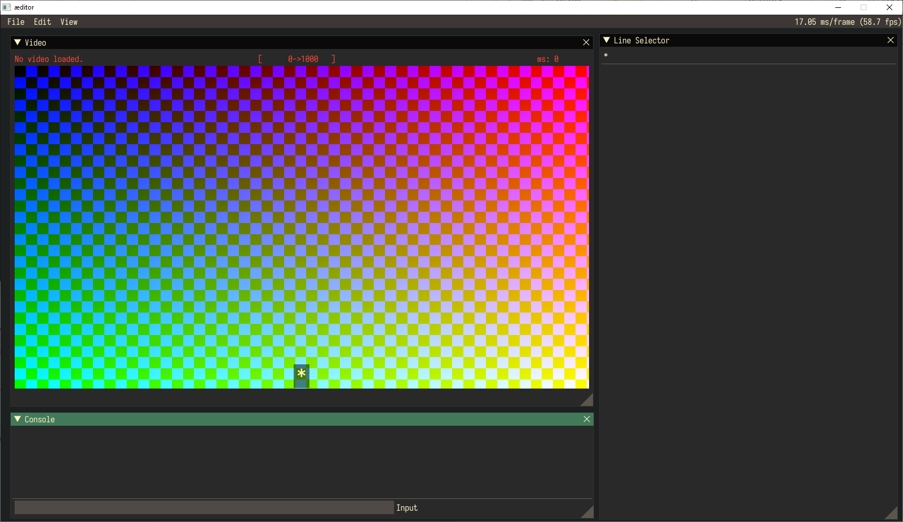
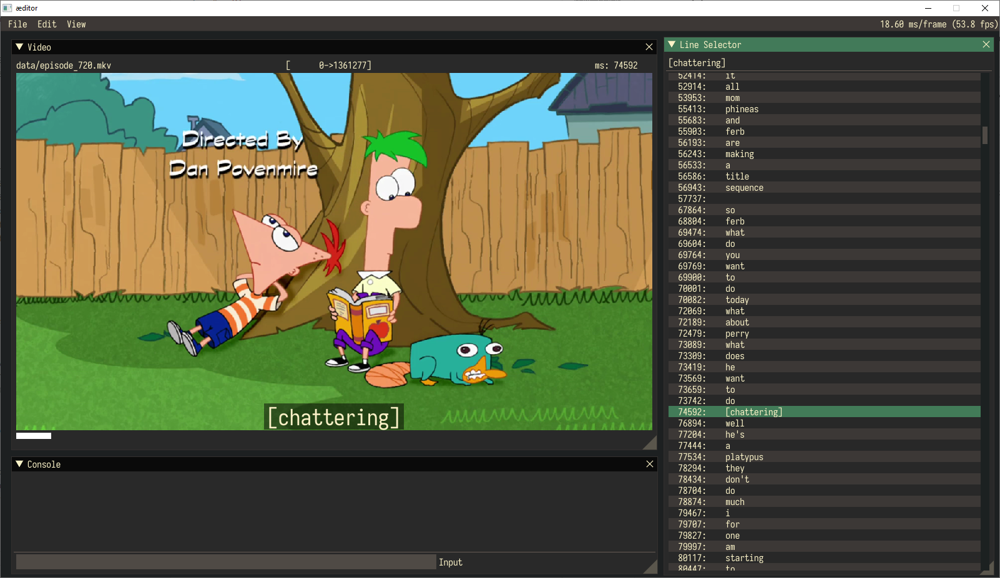

# aeditor
A video editor designed to aid in labeling and alphabetizing videos. Compiles on both Windows and Linux.

## Requirements

- C++17 compiler (GCC, Clang)
- CMake 3.16+
- SFML 2.6+
- libVLC 3.x (development headers)
- OpenGL

### Fedora

```bash
sudo dnf install gcc-c++ cmake SFML-devel vlc-devel mesa-libGL-devel
```

### Ubuntu/Debian

```bash
sudo apt install g++ cmake libsfml-dev libvlc-dev libgl1-mesa-dev
```

## Building

```bash
mkdir build && cd build
cmake ..
cmake --build .
```

## Running

```bash
cd build
./aeditor
```

## Optional Tools

### Transcription (Ctrl+T) — Whisper

```bash
uv tool install openai-whisper
```

### Forced Alignment (Ctrl+A) — Montreal Forced Aligner

Requires [conda](https://docs.conda.io/en/latest/miniconda.html):

```bash
conda create -n aligner -c conda-forge montreal-forced-aligner
conda run -n aligner mfa model download acoustic english_us_arpa
conda run -n aligner mfa model download dictionary english_us_arpa
```

You can customize the conda environment name and models via environment variables:

| Variable | Default | Description |
|----------|---------|-------------|
| `MFA_ENV` | `aligner` | Conda environment name |
| `MFA_DICT` | `english_us_arpa` | MFA dictionary name |
| `MFA_MODEL` | `english_us_arpa` | MFA acoustic model name |
| `WHISPER_MODEL` | `base` | Whisper model size (`tiny`, `base`, `small`, `medium`, `large`) |

## Usage

Open a video with **Ctrl+O**, enter the filename without extension, and click **Auto-find**. This loads both the video (`.mkv`) and its script (`.csv`) if one exists.

### Keyboard Shortcuts

| Key | Action |
|-----|--------|
| Space | Play / Pause |
| Left / Right | Seek ±5 seconds |
| Up / Down | Jump to previous / next line |
| S | Seek to specific timestamp |
| V | Toggle video window |
| L | Toggle loop on current line |
| C | Set current line's timestamp to playback position |
| \\ | Edit current line |
| Shift+\\ | Set current line's timestamp without opening editor |
| [ / ] | Adjust line timestamp ±50ms |
| Alt+[ / Alt+] | Adjust line timestamp ±10ms |
| Shift+[ / Shift+] | Adjust next line's timestamp ±50ms |
| Delete | Delete current line |
| Ctrl+O | Open file |
| Ctrl+S | Save CSV |
| Ctrl+N | New line at current timestamp |
| Ctrl+L | Toggle line selector |
| Ctrl+A | Align line (Montreal Forced Aligner) |
| Ctrl+T | Transcribe line (Whisper) |
| Ctrl+Z | Undo last delete |

## Gallery

**No video loaded**


**Example video loaded**


## License

This software is released under the MIT License. See the [LICENSE](LICENSE) file for more information.
