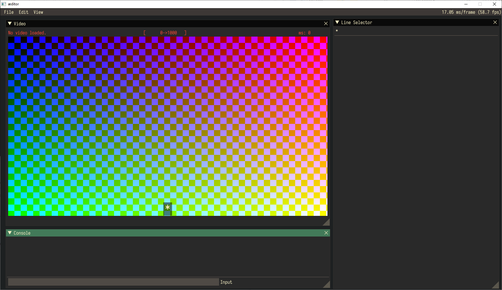

# aeditor
A video editor designed to aid in labeling and alphabetizing videos. Compiles on both Windows and Linux.

# 💻 Requirements
Gentle, Montreal Forced Aligner ffmpeg, Dear Imgui, imgui-sfml, vlc-windows, and SFML 2.5.1

# 🖼&#xFE0F; Gallery

**No video loaded**

**Example video loaded**

# 📜 Licence

This software is released under the MIT License. See the [LICENSE](LICENSE) file for more information.